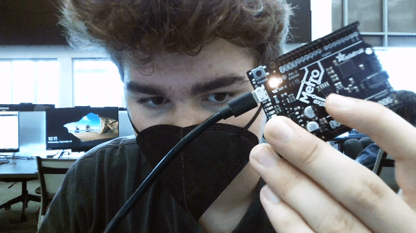

# CircuitPython
Year Long Engineering 3 Notebook
## Hello_CircuitPython
### Description and Code
My first assignment was to upload CircuitPython code to a metro express and make it blink. My second assignment was to upload it here.

```
import board
import neopixel
import time

dot = neopixel.NeoPixel(board.NEOPIXEL, 1)
dot.brightness = 0.1

while True:
    print("Make it pink")
    dot.fill((25,0,25))
    time.sleep(0.2)
    print("Make it orange")
    dot.fill((255, 125, 0))
    time.sleep(0.2)

```
### Evidence


### Reflection
I had difficulties adding my GIF to github, and that was about it. The problem was solved by google searching key words in the error message on git bash.
## CircuitPython Servo
### Description and Code
The assignment was to get a Servo to rotate 180 degrees using CircuitPython Code. 

```
import time
import board
import pwmio
import servo

# create a PWMOut object on Pin A2.
pwm = pwmio.PWMOut(board.A2, duty_cycle=2 ** 15, frequency=50)

# Create a servo object, my_servo.
my_servo = servo.Servo(pwm)

while True:
    for angle in range(0, 180, 5):  # 0 - 180 degrees, 5 degrees at a time.
        my_servo.angle = angle
        time.sleep(0.05)

    for angle in range(180, 0, -5):  # 180 - 0 degrees, 5 degrees at a time.
        my_servo.angle = angle
        time.sleep(0.05)
        
```
### Evidence


Image credit goes to [Asher Friedman](https://github.com/afriedm49/Circuit_Python_Asher)

### Reflection
I had difficulties uploading my code from the right folder as well as getting it to upload. I had to switch to my CircuitPython folder and named the file code.py.
## CircuitPython Ultrasonic Sensor
### Description and Code
My assignment was to make a neopizel change color based on the distance read from an ultrasonic sensor.
```
import time
import board
import neopixel
import adafruit_hcsr04
sonar = adafruit_hcsr04.HCSR04(trigger_pin=board.D7, echo_pin=board.D8)

led = neopixel.NeoPixel(board.NEOPIXEL, 1)
led.brightness = .15
color = str
cm = 0

while True:
    try:
        cm = round(sonar.distance)
        if cm < 10:
            led.fill((255, 153, 51))
        
        elif cm < 20:
            led.fill((255, 51, 255))
            
        elif cm > 20:
            led.fill((153, 255, 255))
        print((sonar.distance,))
        
    except RuntimeError:
        print("JOE!")
    time.sleep(0.1)
```
### Evidence
<img src="Media/Ultrasonic.gif.gif" alt="gif"
